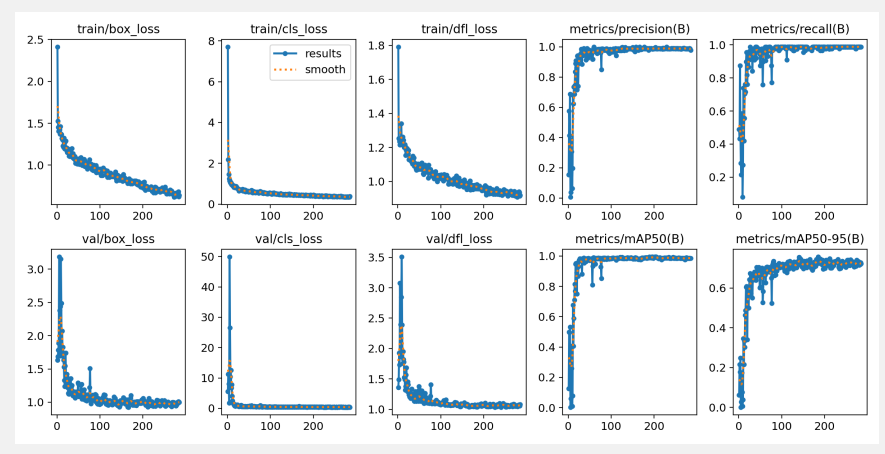

# GagarinHack


# [Ссылка на готовое решение](https://gagarin.shmyaks.ru/)

### Задача: разработать сервис, позволяющий в режиме работы по api с определенной вероятностью классифицировать фото-сканы автомобильных документов по их типам - определить вероятности соответствия конкретному типу.

## Используемый стек технологий:
- [GO-Backend](https://github.com/ultraevs/GagarinHack/tree/main/go-backend) - Реализован с использванием [GO](https://go.dev/) и фреймворка [Gin](https://github.com/gin-gonic/gin). Задачей модуля является реализация API для взаимодействия с frontend модулем.
- [Python-Backend](https://github.com/ultraevs/GagarinHack/tree/main/python-backend) - Реализован с использованием [Python](https://www.python.org/) и фреймворка [Fast-API](https://fastapi.tiangolo.com/ru/) - Задачей модуля является обеспечение взаимодействия бекенда сайта и cv модели.
- [Frontend](https://github.com/ultraevs/GagarinHack/tree/main/frontend) - Реализован с использованием [React](https://ru.legacy.reactjs.org/). Задачай является предоставление красивого и функционалоного интерфейса для пользователя.
- [Deployment](https://github.com/ultraevs/GagarinHack/tree/main/deployment) - Реализован с использованием [Docker-Compose](https://www.docker.com/). Задачей модуля является возможность быстрого и безошибочного развертывания приложения на любом сервере.
- [CV](https://github.com/ultraevs/GagarinHack/tree/main/python-backend/cv) - Реализован с использованием [YOLOv8](https://docs.ultralytics.com/ru/models/yolov8/). Задачей модуля является распознавание типа документа на предоставленных фото пользователя.

## Функционал решения

- Загрузка документа.
- Распознавание серии и номера документа, а также его типа.

## Как работает решение

1. API принимает изображение в формате base64, декодирует его и передает в модель.
2. Нормализация изображения:
   
   Используя результаты модели, производится определение координат углов документа.
   После этого происходит аппроксимация контура документа до четырех углов.
   На основе угловых точек определяются границы изображения.
   Выполняется перспективное преобразование (выпрямление) изображения с учетом определенных границ.
3. Классификация типа документа:

    Проводится классификация изображения с использованием предварительно обученной модели TensorFlow/Keras.
    Модель определяет тип документа на основе содержимого изображения.
4. Чтение текста с изображения:

    С помощью модели обнаружения текста определяются области с текстом на изображении.
    Каждая область текста обрезается и передается в модель для извлечения фактического текста.
    Полученные текстовые данные агрегируются и предоставляются как результат обработки.
5. Модель возвращает результат в формате json, который выводиться на фронтенд.


## График Точности Обучения модели классификации


Этот график отображает улучшение точности нашей модели с каждой эпохой обучения. Две кривые представляют тренировочную (синий цвет) и валидационную (красный цвет) точность. Мы видим, что модель демонстрирует стабильное улучшение точности на протяжении первых эпох, после чего достигает плато, что указывает на то, что модель достигла своей оптимальной способности к обобщению на предоставленных данных. Точность на валидационных данных остается высокой во всем диапазоне обучения, что свидетельствует о хорошей обобщающей способности и предотвращении переобучения.

## Результаты тренировки модели поиска текста

В процессе разработки нашего решения мы внимательно отслеживали различные аспекты производительности модели. Ниже представлены графики, иллюстрирующие эффективность модели во время тренировочного и валидационного процесса:



### Объяснение графиков:

- **train/box_loss и val/box_loss**: Эти графики показывают потери, связанные с ограничивающими рамками (bounding boxes), на тренировочных и валидационных данных соответственно. Уменьшение значений потерь указывает на улучшение способности модели правильно определять положение объектов.

- **train/cls_loss и val/cls_loss**: Здесь отображены потери классификации на тренировочных и валидационных данных. Снижение этих значений свидетельствует о том, что модель лучше распознает и классифицирует различные типы документов.

- **train/df1_loss и val/df1_loss**: Эти графики могут представлять дополнительные метрики качества модели, такие как F1-мера, демонстрирующие улучшение производительности модели во время тренировок и валидации.

- **metrics/precision(B) и metrics/recall(B)**: Показывают точность и полноту модели на валидационном наборе данных, соответственно. Высокие и стабильные значения указывают на надежность модели в обнаружении и правильном классифицировании документов.

- **metrics/mAP50(B) и metrics/mAP50-95(B)**: Эти графики показывают среднюю точность модели (mAP) при пороге IoU=0.5 и среднюю точность при порогах IoU от 0.5 до 0.95. Высокие значения mAP по всем классам подтверждают высокую надежность модели при различных уровнях строгости.

## Запуск решения
Необходимо создать .env файлы в папках go-backend и python-backend, в которых должны содержаться ваши данные о сервере,базе данных и почтовом аккаунте. Также в вашем nginx и postgresql на сервере нужно указать те же порты что и в коде(местами из .env)
```sh
    cd GagarinHack/deployment
    docker-compose build
    docker-compose up -d
```
